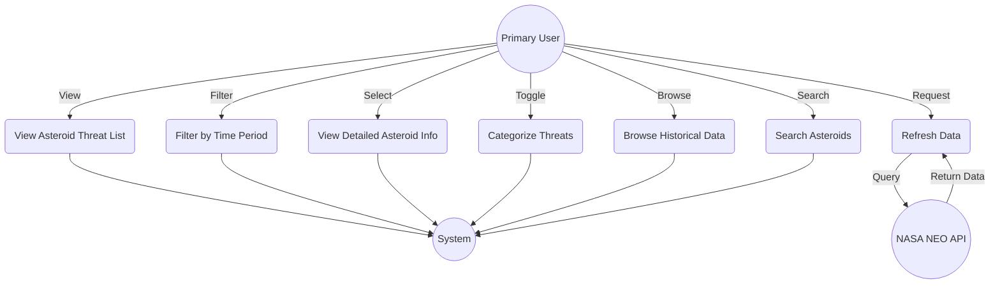

# Project Proposal - Lab 8

## 1. Team Number

**Team Number:** 16-4

## 2. Team Name

**Team Name:** Woodwinds in Space

## 3. Team Members

**Team Members:**

- Kelsea Hall - keha5124 - keha5124@colorado.edu
- Mark Worster - mawo2024 - mawo2024@colorado.edu
- Reed Colloton - reed-colloton - reco9501@colorado.edu
- Zachary McGuire - ZackMcGuire - zamc6801@colorado.edu

## 4. Application Name

**Application Name:** Asteroid Detector 3000

## 5. Application Description

**Asteroid Detector 3000** is an educational and interactive web application designed to bring the cosmos closer to home by tracking and visualizing potential asteroid threats. The application aggregates real-time data from NASA's Near Earth Object (NEO) API to present a curated list of asteroids that will pass by Earth in the coming centuries. Users can view critical data points such as approach date, estimated diameter, relative velocity, and potential impact probability, all presented in a user-friendly interface.

Beyond simple data listing, the application aims to demystify space science for a younger audience. It features interactive charts and visualizations that explain the scale and potential impact of these celestial bodies. Users can drill down into specific asteroids to learn more about their composition and trajectory. By combining hard data with engaging educational content, Asteroid Detector 3000 serves as both a monitoring tool and a learning platform.

The application also includes historical data analysis, allowing users to see how asteroid tracking has evolved and compare current threats against past close encounters. With features like threat categorization and time-period filtering, users can easily explore the data that interests them most. The goal is to transform complex astronomical data into an accessible and exciting experience that sparks curiosity about our universe and the science of planetary defense.

## 6. Audience

**Target Audience:** Middle school students (ages 11-14) and space enthusiasts.

**Problem Solved:** Space science, particularly the topic of asteroid impacts, can be overwhelming and scary for young students due to complex data and sensationalized media reports. Existing tools are often too technical for this age group, making it difficult for them to understand the actual risks and science behind near-earth objects. This application solves this by translating complex NASA data into an understandable, non-threatening, and educational format.

**Usability & Accessibility:** The application is designed with a "kid-first" approach. The interface will feature large, clear fonts, intuitive navigation, and engaging visuals to maintain interest. Technical jargon will be minimized or explained through tooltips and "Fun Fact" sections. High-contrast colors and simple layouts will ensure the site is accessible to users with varying levels of digital literacy and visual abilities.

## 7. Vision Statement

For middle school students who are curious about space and potential threats to Earth, the Asteroid Detector 3000 is an educational web application that provides real-time, easy-to-understand tracking of near-earth asteroids. Unlike complex scientific databases like the NASA JPL website, our product translates technical data into engaging visuals and kid-friendly explanations to make planetary defense accessible and less frightening.

## 8. Version Control

**GitHub Repository:** https://github.com/CU-CSCI3308-Fall2025/group-project-reed-colloton

### Repository Structure

The repository is organized as follows:

```
group-project-[username]/
├── TeamMeetingLogs/
│   └── meeting_minutes.md          # Weekly meeting minutes with TA
├── MilestoneSubmissions/
│   ├── ProjectProposal.md          # This document
│   └── [Future milestone documents]
├── ProjectSourceCode/
│   ├── .gitignore                  # Git ignore rules
│   ├── src/                        # Source code (to be created)
│   ├── public/                     # Static assets (to be created)
│   ├── docker-compose.yaml         # Docker configuration (to be created)
│   └── [Application files]
└── README.md                       # Project overview and setup instructions
```

**Repository Access:** All team members have been added as collaborators with write access to the repository.

**Branching Strategy:** We will follow a feature-branch workflow where each major feature is developed in its own branch and merged into main after code review.

## 9. Development Methodology

**Methodology:** Agile with Scrum practices

**Approach:**
We will use an Agile development methodology with Scrum practices adapted for our 4-week timeline. Our approach includes:

- **Sprint Planning:** Weekly sprints aligned with our TA meetings. Each sprint will have defined goals and deliverables.
- **Daily Standups:** Brief asynchronous updates in our communication channel (what we did, what we're working on, any blockers).
- **Kanban Board:** GitHub Projects board to track user stories, tasks in progress, and completed items.
- **Sprint Reviews:** Weekly demonstrations of completed features to the TA.
- **Sprint Retrospectives:** Weekly team reflection on what went well and what can be improved.

**User Stories:** We will break down features into user stories following the format: "As a [user type], I want to [action] so that [benefit]." Each user story will be tracked as an issue on GitHub Projects.

**Task Management:**

- Tasks will be assigned during sprint planning
- Each task will have clear acceptance criteria
- Progress will be tracked on our Kanban board (To Do, In Progress, Review, Done)
- We will use GitHub issue comments for task-specific communication

## 10. Communication Plan

**Communication Channels:**
We will use **Slack** as our primary collaboration tool for daily communication, file sharing, and asynchronous updates. We will refrain from using personal Instant Messaging (IMs) or text messages for project-related work to ensure all information is centralized and accessible to the entire team.

**Coordination:**
We will use the Slack channel `#general` for team announcements and `#dev` for technical discussions. GitHub Issues and Project Boards will be used to track specific tasks and link code changes to requirements.

## 11. Meeting Plan

**Team Meetings:**

- **When:** Fridays at 11:00 AM - 11:15 AM (Weekly)
- **Where:** Zoom (Link posted in Slack)
- **Agenda:** Review progress, discuss blockers, and plan the next sprint.

**Weekly TA Meeting:**

- **When:** [Insert TA Meeting Day/Time here, e.g., Wednesdays during Lab]
- **Where:** [Insert Location, e.g., CSEL Lab or Zoom]
- **Expectations:** We will present our weekly progress, show the current state of the application, and review the meeting minutes with the TA.

## 12. Use Case Diagram

**Actors:**

- Primary User (Space Enthusiast/General Public)
- System (Backend scheduler)
- NASA NEO API (External data source)

**Use Cases:**

1. **View Asteroid Threat List**

   - Description: User can view a list of potentially hazardous asteroids ranked by threat level
   - Actor: Primary User
   - Flow: User accesses application → System displays top 10 threatening asteroids with key data → User can scroll and view details

2. **Filter by Time Period**

   - Description: User can filter asteroid threats by different time horizons
   - Actor: Primary User
   - Flow: User selects time period (Forever, 2030, 2040, 2050, 2075, 2100, 2150, 2200) → System filters and displays relevant asteroids for that timeframe

3. **View Detailed Asteroid Information**

   - Description: User can click on an asteroid to view comprehensive details
   - Actor: Primary User
   - Flow: User selects asteroid from list → System displays detailed information including size, velocity, orbit, impact probability, and approach date

4. **Categorize Threats**

   - Description: System categorizes asteroids into "Top Threats" and "High Chance" groups
   - Actor: Primary User, System
   - Flow: User toggles between threat categories → System displays asteroids filtered by threat classification

5. **Refresh Data**

   - Description: User can refresh to retrieve the latest asteroid data from NASA
   - Actor: Primary User, NASA NEO API
   - Flow: User initiates refresh (pull-to-refresh or button) → System queries NASA API → Updates database → Displays fresh data

6. **Browse Historical Data**

   - Description: User can view historical asteroid approach data and compare threat levels over time
   - Actor: Primary User
   - Flow: User navigates to historical view → System retrieves stored data from database → Displays trends and past assessments

7. **Search Asteroids**
   - Description: User can search for specific asteroids by name or designation
   - Actor: Primary User
   - Flow: User enters asteroid name/ID in search → System queries database → Displays matching asteroid(s) with full details

**Use Case Diagram:**



## 13. Wireframes

We have designed wireframes for the key pages of our application.

**Uploaded Wireframes:**

- `Login or Register.jpg`: User authentication screen.
- `Fun facts.jpg`: Educational content page.

**Additional Wireframes:**
Please refer to `MilestoneSubmissions/Wireframes/Wireframe_Descriptions.md` for detailed layouts of the following pages:

1.  **Main Dashboard (Threat List):** The central hub showing the list of asteroids.
2.  **Asteroid Detail Page:** The specific view for a single asteroid.
3.  **Historical Data View:** The page for browsing past data.

[Link to Wireframe Descriptions](./Wireframes/Wireframe_Descriptions.md)

## EXTRA CREDIT: Risk Analysis

| Risk # | Risk Description                                                                                                                                                                           | Severity | Mitigation Strategy                                                                                                        |
| ------ | ------------------------------------------------------------------------------------------------------------------------------------------------------------------------------------------ | -------- | -------------------------------------------------------------------------------------------------------------------------- |
| 1      | If the website isn't intuitive to use. This could prevent some people from using it.                                                                                                       | Medium   | This could be mitigated with icons and putting all links in the nav bar.                                                   |
| 2      | If the external API we're using changes or goes down. This would completely brick our website.                                                                                             | High     | We'll make a backup database copy just in case.                                                                            |
| 3      | If our calculations end up being completely wrong. This wouldn't make the application stop working, but providing misleading or incorrect estimates about asteroid risk wouldn't be ideal. | Medium   | At the very least, we'll check a few calculations with what scientists have made to make sure we're in the right ballpark. |
| 4      | If we get rate-limited by the external API. This could cause our website to slow down or stop working completely.                                                                          | High     | We'd need to figure out what that limit is, and slow down requests if we get close to it.                                  |
| 5      | If we get caught up in scope creep. This would hurt our ability to get out a working, complete project by the deadline.                                                                    | Medium   | We'll need to make sure to have a minimum viable product with plenty of time to spare.                                     |
